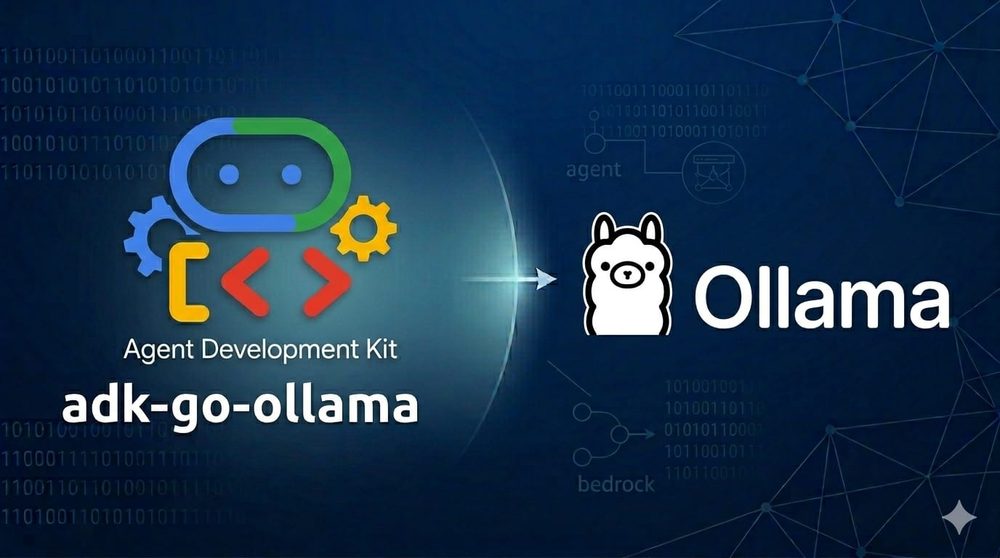

<p align="center">
  
</p>

# adk-go-ollama

[Ollama](https://ollama.com/) **Chat** implementation of the [`model.LLM`](https://pkg.go.dev/google.golang.org/adk/model#LLM) interface for [adk-go](https://github.com/google/adk-go), so you can run agents on local models like Llama 3, Mistral, and others with the same ADK APIs you use for Gemini.

**Other providers:** [adk-go-bedrock](https://github.com/craigh33/adk-go-bedrock) · [adk-go-kronk](https://github.com/craigh33/adk-go-kronk)

## Requirements

- **Go** 1.25+ (aligned with `google.golang.org/adk`)
- **[Ollama](https://ollama.com/)** running locally or reachable over the network (default client URL `http://localhost:11434`; use [`ollama.WithBaseURL`](ollama/ollama.go) for a remote instance)

## Install

```bash
go get github.com/craigh33/adk-go-ollama
```

Replace the module path with your fork or published path if you rename the module in `go.mod`.

## Usage

```go
m, err := ollama.New("gemma3")
if err != nil {
    log.Fatal(err)
}

agent, err := llmagent.New(llmagent.Config{
    Name:  "assistant",
    Model: m,
    Instruction: "You are helpful.",
})
// Wire agent into runner.New(...) as usual.
```

`ollama.New` accepts a **model name** as recognized by your Ollama instance. [`LLMRequest.Model`](https://pkg.go.dev/google.golang.org/adk/model#LLMRequest) can override the model name at runtime (e.g. from ADK callbacks).

The [`internal/mappers`](internal/mappers/) package holds genai ↔ Ollama conversions (requests, responses, tools, usage). It is internal to this module and used by the [`ollama`](ollama/) package.

## Examples

Each example has its own `README.md` and `Makefile`:

- [`examples/ollama-chat`](examples/ollama-chat): runner-based chat example.
- [`examples/ollama-tool-calling`](examples/ollama-tool-calling): tool-calling agent example with function declarations.
- [`examples/ollama-imagegen`](examples/ollama-imagegen): image generation via `x/flux2-klein:4b` using ADK's tools.
- [`examples/ollama-stream`](examples/ollama-stream): direct streaming example using `GenerateContent(..., true)`.
- [`examples/ollama-multimodal`](examples/ollama-multimodal): image analysis and multi-image comparison using vision models like `llava`.
- [`examples/ollama-web-ui`](examples/ollama-web-ui): ADK local web UI launcher to interact with your Ollama agent.

All examples assume Ollama is reachable at the default URL and optionally use **`OLLAMA_MODEL`** to override the default chat model. The image generation example also supports **`OLLAMA_IMAGE_MODEL`** for the Flux image model.

```bash
export OLLAMA_MODEL=llama3.3
make -C examples/ollama-chat run
```

Run streaming example:

```bash
make -C examples/ollama-stream run
```

## How it maps to Ollama

- **Messages**: `genai` roles `user` and `model` map to Ollama `user` and `assistant`. Optional `system` role entries in the conversation are mapped to Ollama `system` messages.
- **System instruction**: `GenerateContentConfig.SystemInstruction` is sent as Ollama system content ahead of the conversation turns.
- **Tools**: the mapper converts `GenerateContentConfig.Tools` entries whose **`FunctionDeclarations`** are present into Ollama function tools. Other `genai.Tool` variants are not translated to Ollama's chat API (use ADK patterns such as `mcptoolset` if you need MCP tools surfaced as function declarations).
- **Function responses**: JSON tool output is mapped to Ollama `tool` role messages with the corresponding tool name and call ID.
- **Streaming**: When ADK uses SSE streaming, the provider streams the chat response and yields partial outputs, buffering until usage metadata completes the turn.
- **Multimodal user content**: Inline image data on user turns is mapped to Ollama image payloads where the model supports vision; other media types follow the constraints described under [Limitations](#limitations).

## Limitations

- **Unsupported features**: Tool variants not supported by Ollama cause a request-time error. Advanced features that don't map cleanly may be ignored or return an explicit ADK error.
- **Multimodal content**: Ollama natively only supports base64-encoded images. While the ADK can handle arbitrary blobs natively (like PDFs, documents, or spreadsheets), the `adk-go-ollama` provider will only process `genai.InlineData` as images via a vision model. Arbitrary file attachments are ignored or rejected by the Ollama API.
- **Image generation**: Ollama's image generation feature currently only supports macOS and `x/flux2-klein:4b` (based on Flux architectures) and requires a large memory footprint (~12GB). It only supports single image generation requests at a fixed step count natively via `/v1/images/generations`.

## Contributing

See [CONTRIBUTING.md](CONTRIBUTING.md) for Makefile targets, required pre-commit setup, commit message conventions, and pull request guidelines. For new issues, use the [bug report](https://github.com/craigh33/adk-go-ollama/issues/new?template=bug_report.yml) or [feature request](https://github.com/craigh33/adk-go-ollama/issues/new?template=feature_request.yml) templates.

## License

Apache 2.0 — see [LICENSE](LICENSE).

[Contributing](CONTRIBUTING.md) · [Issues](https://github.com/craigh33/adk-go-ollama/issues) · [Security](https://github.com/craigh33/adk-go-ollama/security)
